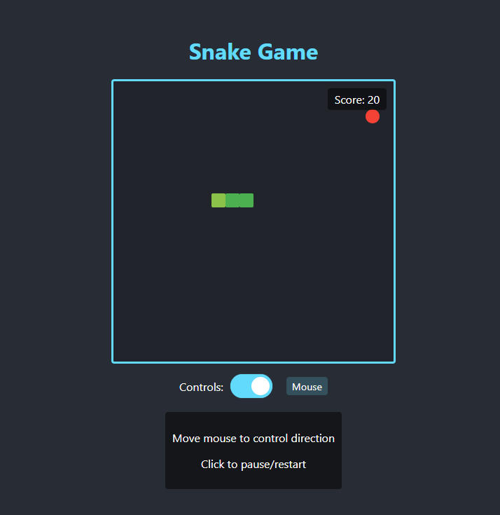

# Snake Game

A classic Snake game built with React, TypeScript and Vite.

## Features

- Responsive game board
- Keyboard and mouse controls
- Pause/resume functionality
- Score tracking
- Game over detection

## How to Play

### Keyboard Controls
- Use arrow keys (↑, ↓, ←, →) to control the snake
- Press Space to pause/resume the game
- After game over, press Space to restart

### Mouse Controls
- Move your mouse to direct the snake (snake follows cursor direction)
- Click on the game board to pause/resume the game
- After game over, click to restart

### Switching Controls
You can toggle between keyboard and mouse controls using the control switcher below the game board.

## Getting Started

1. Install dependencies:
```bash
npm install
```

2. Start the development server:
```bash
npm start
# or
npm run dev
```

3. Open your browser to http://localhost:3000 to play the game

## Building for Production

```bash
npm run build
```

The build output will be in the `dist` folder.

## Preview
